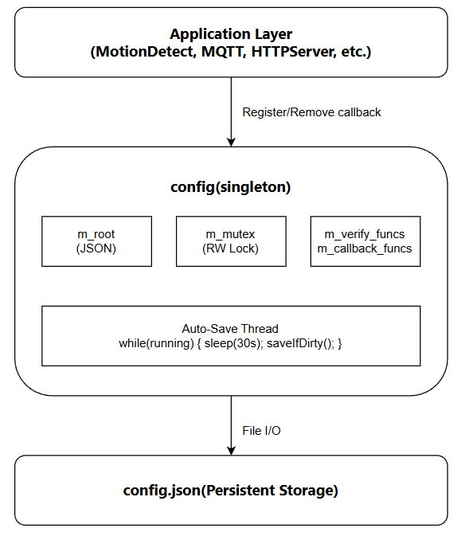

# Config Module Design Document

## 1. Document Information

**Module Name:** Configuration Management System 
**Author:** xbs5520
**Date:** December 10, 2025 
**Version:** 1.0
**Project:** IoT Gateway

---

## 2. Module Overview

### 2.1 Purpose
The Config module provides a **thread-safe**, **centralized configuration management system** for the IoT Gateway application. It enables multiple components to read and modify runtime configurations concurrently while maintaining data consistency and integrity.

### 2.2 Key Features

- **Thread-Safe Operations**: Concurrent read/write access using reader-writer locks
  
- **Observer Pattern**: Dynamic registration/removal of verification and callback functions
  
- **Auto-Save Mechanism**: Periodic automatic persistence with dirty flag optimization
  
- **JSON-Based Storage**: Human-readable configuration format using `nlohmann/json` library
  
- **Singleton Pattern**: Global access point with lazy initialization

### 2.3 Design Goals

1. **Concurrency Safety**: Support multiple threads reading/writing configurations simultaneously
2. **Data Integrity**: Ensure configuration changes are validated before persistence
3. **Minimal Latency**: Optimize lock granularity to reduce contention
4. **Lifecycle Safety**: Prevent dangling pointers when observers are destroyed


## 3. Architecture Design

### 3.1 Class Structure

**Core Members:**

```c++
class Config {
private:
    json m_root;                              // Configuration data storage
    std::shared_mutex m_mutex;                // Reader-writer lock
    bool m_dirty;                             // Dirty flag for auto-save
    std::atomic<bool> m_auto_save_running;    // Auto-save thread control
    std::thread m_auto_save_thread;           // Background save thread
    std::string m_file_path;                  // Config file path
    std::map<std::string, std::vector<VerifyWrapper*>> m_verify_funcs;
                                              // Verification callbacks per config key
    std::map<std::string, std::vector<CallbackWrapper*>> m_callback_funcs;
                                              // Notification callbacks per config key
};
```

### 3.2 Wrapper Classes (Type Erasure Pattern)

To support both **global functions** and **member functions** as callbacks, we use the **Type Erasure** design pattern.

#### **Base Wrapper Interface**

```c++
class VerifyWrapper {
public:
    virtual ~VerifyWrapper() = default;
    virtual bool call(const json& config) = 0;      // Pure virtual call interface
    virtual void* getOwner() const = 0;             // Get owner object pointer(not use)
    												// for remove all object callback fun
};
```

#### **Concrete Wrapper Implementations**

**1. Global Function Wrapper:**

```c++
class GlobalVerifyWrapper : public VerifyWrapper {
public:
    bool (*func)(const json&);                      // Function pointer
    bool call(const json& config) override {
        return func(config);                         // Direct call
    }
    void* getOwner() const override {
        return nullptr;                              // No owner for global functions
    }
};
```

**2. Member Function Wrapper:**

```c++
template<typename T>
class MemberVerifyWrapper : public VerifyWrapper {
private:
    T* m_obj;                                       // Object instance
    bool (T::*m_func)(const json&);                 // Member function pointer
public:
    bool call(const json& config) override {
        return (m_obj->*m_func)(config);            // Call via object pointer
    }
    void* getOwner() const override {
        return m_obj;                                // Return owner object
    }
};
```

### 3.3 Component Interaction Diagram



### 3.4 Lock Strategy

**Reader-Writer Lock (std::shared_mutex):**

- **Shared Lock (Read)**: Multiple threads can read simultaneously
- **Unique Lock (Write)**: Exclusive access for write operations

**Lock Granularity:**

```c++
// Fine-grained locking example:
{
    std::shared_lock<std::shared_mutex> lock(m_mutex);  // Read lock
    // Copy data inside lock
    verify_list = m_verify_funcs[name];
}   // Lock released here

// Call callbacks OUTSIDE lock to avoid deadlock
for (auto wrapper : verify_list) {
    wrapper->call(config);
}
```

## 4. Thread Safety Strategy

### 4.1 Synchronization Mechanism

\- **Lock Type**: `std::shared_mutex` (C++17 reader-writer lock)

\- **Read Operations**: Use `std::shared_lock` for concurrent reads

\- **Write Operations**: Use `std::unique_lock` for exclusive writes

### 4.2 Deadlock Prevention

The `setConfig()` method uses a ***\*three-stage approach\**** to prevent deadlock when callbacks invoke `setConfig()` recursively:

1. **Verify Stage** (shared lock): Copy callback list, validate new value

2. **Update Stage** (unique lock): Modify data, set dirty flag

3. **Notify Stage** (no lock): Invoke callbacks outside lock scope

**Reason**: Callbacks may call `setConfig()` again. Releasing locks before callback invocation prevents circular lock dependencies.

### 4.3 Auto-Save Optimization

File I/O operations in `saveIfDirty()` occur **outside the critical section**:

\- Copy data under lock → Release lock → Perform I/O → Re-acquire lock to clear dirty flag

\- Reduces lock contention

### 4.4 Observer Lifecycle Management

Components must call `removeVerify()` and `removeOnConfig()` in destructors to prevent dangling pointer access. 

Uses erase-remove idiom with `dynamic_cast` for type-safe removal.

## 5. API Documentation

### 5.1 Core APIs

```c++
static Config& getInstance();
```

#### `getInstance()`

**Description**: Get singleton instance (thread-safe)

**Returns**: Reference to Config singleton

**Thread Safety**: Yes (Meyer's Singleton, C++11 guarantee)

#### `load()`

```c++
bool load(const std::string& file_path);
```

**Description**: Load configuration from JSON file and start auto-save thread

**Parameters**:

- `file_path`: Path to configuration file

**Returns**:

- `true`: Load successful
- `false`: File not found or parse error

**Side Effects**: Starts auto-save thread (30s interval)

#### `save()`

```c++
bool save();
```

**Description**: Manually save configuration to file

**Returns**:

- `true`: Save successful
- `false`: File write error

**Thread Safety**: Yes (unique lock)

#### `getConfig()`

```c++
json getConfig(const std::string& name);
```

**Description**: Retrieve configuration by key

**Parameters**:

- `name`: Configuration key

**Returns**: JSON object (empty if key not found)

**Thread Safety**: Yes (shared lock)

**Example**:

```c++
json detector_cfg = Config::getInstance().getConfig("detector");
int threshold = detector_cfg["motion_threshold"];
```

#### `setConfig()`

```c++
bool setConfig(const std::string& name, const json& config);
```

**Description**: Update configuration with validation and notification

**Parameters**:

- `name`: Configuration key
- `config`: New configuration value

**Returns**:

- `true`: Update successful
- `false`: Verification failed or no change

**Behavior**:

1. Runs all registered verify functions
2. Updates configuration if validation passes
3. Triggers all registered callbacks
4. Sets dirty flag for auto-save

**Thread Safety**: Yes (three-stage locking)

### 5.2 Observer Registration

#### `registerVerify()` - Global Function

```c++
void registerVerify(const std::string& name, bool (*verify_func)(const json&));
```

**Description**: Register global verification function

**Parameters**:

- `name`: Configuration key to monitor
- `verify_func`: Validation function pointer

**Example**:

```c++
bool validateThreshold(const json& cfg) {
    return cfg["threshold"] >= 0 && cfg["threshold"] <= 100;
}
Config::getInstance().registerVerify("detector", validateThreshold);
```

#### `registerVerify()` - Member Function

```c++
template<typename T>
void registerVerify(const std::string& name, T* obj, bool (T::*func)(const json&));
```

**Description**: Register member function verification

**Parameters**:

- `name`: Configuration key to monitor
- `obj`: Object instance pointer
- `func`: Member function pointer

**Example**:

```c++
class MotionDetector {
    bool verifyMotionConfig(const json& cfg) { /* ... */ }
};

MotionDetector detector;
Config::getInstance().registerVerify("detector", &detector, 
                                     &MotionDetector::verifyMotionConfig);
```

#### `registerOnConfig()` - Global Function

```c++
void registerOnConfig(const std::string& name, void (*callback_func)(const json&));
```

**Description**: Register global callback for config changes

**Example**:

```c++
void onDetectorChange(const json& cfg) {
    printf("Detector config changed: %s\n", cfg.dump().c_str());
}
Config::getInstance().registerOnConfig("detector", onDetectorChange);
```

#### `registerOnConfig()` - Member Function

```c++
template<typename T>
void registerOnConfig(const std::string& name, T* obj, void (T::*func)(const json&));
```

**Description**: Register member function callback

**Example**:

```c++
class MotionDetector {
    void onMotionConfig(const json& cfg) { /* update settings */ }
};

detector.onMotionConfig = /* ... */;
Config::getInstance().registerOnConfig("detector", &detector,
                                       &MotionDetector::onMotionConfig);
```

### 5.3 Observer Removal

#### `removeVerify() / removeOnConfig()`

```c++
bool removeVerify(const std::string& name, T* obj);
bool removeOnConfig(const std::string& name, T* obj);
```

**Description**: Remove all callbacks owned by object

**Parameters**:

- `name`: Configuration key
- `obj`: Owner object pointer

**Returns**: `true` if any callback removed

**Critical**: **Must call in destructor** to prevent dangling pointers

**Example**:

```c++
MotionDetector::~MotionDetector() {
    Config::getInstance().removeVerify("detector", this);
    Config::getInstance().removeOnConfig("detector", this);
}
```

### 5.4 Utility APIs

#### `toJsonString()`

```c++
std::string toJsonString();
```

**Description**: Export entire configuration as JSON string

**Returns**: Pretty-printed JSON (4-space indent)

#### `updateFromJson()`

```c++
bool updateFromJson(const std::string& json_str);
```

**Description**: Batch update from JSON string

**Parameters**:

- `json_str`: JSON string containing multiple configs

**Returns**: `true` if all updates successful

**Behavior**: Runs verification for each config, saves if all pass